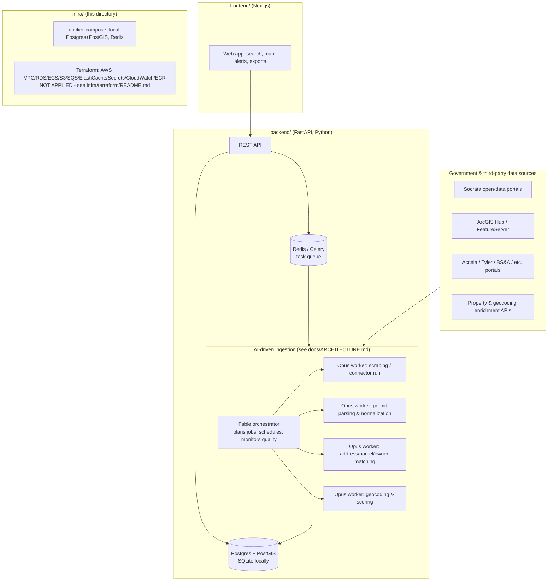

# construction-intel

A US construction-permit and property-intelligence platform. It continuously
ingests building-permit data and property records from thousands of US
jurisdictions, normalizes and enriches them (address/parcel matching, owner
entity resolution, geocoding, project scoring), and exposes the result as a
searchable, alertable database for **contractors, suppliers, lenders,
insurers, and investors** who need to know what's being built, where, by
whom, and how likely it is to be a good lead.

> **Status:** early scaffolding stage. Backend, frontend, infra, and research
> workstreams are being built out in parallel - see [Status & blockers](#status--blockers)
> below for what's actually done vs. still pending as of this writing.

## What this is, concretely

- **For contractors/suppliers:** a feed of newly-filed and in-progress
  permits in your service area, scored by likely project size/value, so you
  can reach out before your competitors do.
- **For lenders/insurers:** property-level construction activity history to
  inform underwriting (e.g., "has this property had a permitted renovation
  in the last N years?").
- **For investors:** a way to screen for properties/areas with rising
  construction activity as a leading indicator.

The core bet is that permit and property data is public but *extremely*
fragmented (tens of thousands of independent government data sources, each
in its own format), and that an AI-driven ingestion pipeline (see
[docs/ARCHITECTURE.md](docs/ARCHITECTURE.md)) can keep adding new
jurisdictions and enrichment sources at a pace and cost that a purely
manual/hand-coded integration team cannot.

## Architecture (high level)



See [`docs/ARCHITECTURE.md`](docs/ARCHITECTURE.md) for the full target design
- the orchestrator/worker ingestion model, the connector plug-in architecture
for adding new jurisdictions, and the append-only versioned data model.

## Directory layout

```
construction-intel/
  backend/     FastAPI + Python backend: API, connectors, scoring, Celery workers
  frontend/    Next.js frontend: search UI, map views, alerts, exports
  infra/       docker-compose (local Postgres/Redis) + Terraform (AWS, not applied)
  research/    Market/vendor/legal research informing data-acquisition strategy
  docs/        Deeper design docs (see ARCHITECTURE.md)
  .github/     CI (GitHub Actions)
```

## Running everything locally (free, no cloud account needed)

### Backend

The backend defaults to a local **SQLite** file so you can run it with zero
external dependencies:

```bash
cd backend
python -m venv venv          # if not already created
source venv/bin/activate     # Windows: venv\Scripts\activate
pip install -r requirements.txt
# DATABASE_URL defaults to sqlite:///./data/construction_intel.db if unset -
# check backend/app/db.py / a backend .env.example once it exists for the
# exact default and how to override it.
uvicorn app.main:app --reload   # once app/main.py exists
```

### Frontend

```bash
cd frontend
npm install     # once package.json exists
npm run dev
```

### Postgres + Redis (optional, once Docker is installed)

Docker is **not installed** on this machine yet (see
[`infra/BLOCKERS.md`](infra/BLOCKERS.md)). Once it is:

```bash
cp infra/.env.example infra/.env
docker compose -f infra/docker-compose.yml --env-file infra/.env up -d
```

Then point the backend at Postgres/Redis instead of SQLite via its `.env`
(`DATABASE_URL=postgresql+psycopg://...`, `REDIS_URL=redis://localhost:6379/0`)
- see comments in `infra/docker-compose.yml` for exact values.

### Production AWS deployment

Written but **deliberately not applied** - see
[`infra/terraform/README.md`](infra/terraform/README.md) for the full
explanation, cost breakdown, and the exact `terraform init && terraform plan`
command to run first. Do not run `terraform apply` without reading that file.

## Status & blockers

Rolled up from each workstream's own `BLOCKERS.md`. This section reflects a
snapshot and should be re-checked against the live files as work progresses.

- **Backend** (`backend/BLOCKERS.md`): not present yet as of this writing -
  the backend has an `app/` package (models, DB layer, permit connectors for
  Socrata/ArcGIS, a normalizer, a scoring engine skeleton) and
  `requirements.txt`, but `tests/`, `routers/`, and `scripts/` are still
  empty and no `BLOCKERS.md` has been written yet. **Re-check this file
  directly once the backend workstream progresses further.**
- **Frontend** (`frontend/BLOCKERS.md`): not present yet - the `frontend/`
  directory is still empty (no `package.json`). **Re-check once the
  frontend workstream starts producing files.**
- **Research** (`research/BLOCKERS.md`): present and substantive. Headline
  takeaways:
  - The permitting-software vendor landscape is fragmented across Accela,
    Tyler (EnerGov/MyGov), OpenGov, Socrata, ArcGIS Hub, BS&A, and many
    smaller/regional vendors, with only an estimated ~3-6% of jurisdictions
    (~25-35% of US population) exposing a true open API/open-data portal
    today - the rest require scraping or are not digitally accessible at
    all. These percentages are explicitly flagged as **estimates**, not an
    audited count.
  - Real money/contract blockers identified: **data broker registration**
    in CA/VT/TX/OR (~$7-8K/yr combined, CA has a narrow Jan filing window),
    **formal legal opinions needed on FCRA/TCPA applicability** before
    selling to lenders/insurers or doing outbound contact, **enterprise
    contact-sales-only pricing** from CoreLogic/Experian/Acxiom/LiveRamp,
    and **per-agency data-sharing agreements** needed for Accela API access
    (can take weeks to months).
  - Full detail in `research/RESEARCH_REPORT.md` and
    `research/BLOCKERS.md`.
- **Infra** (this directory - `infra/BLOCKERS.md`): Docker not installed
  (needs admin + restart for WSL2 on Windows), Terraform CLI not installed,
  no AWS account/billing set up yet (explicitly a human/business decision),
  and a note that a production map tile provider and an email/SMS alert
  provider will need paid plans at scale. Full detail in
  [`infra/BLOCKERS.md`](infra/BLOCKERS.md).

## Contributing / CI

Every push/PR runs [`.github/workflows/ci.yml`](.github/workflows/ci.yml):
ruff + pytest for the backend, npm lint + build for the frontend. The
workflow is written to tolerate the frontend/backend still being mid-build
(skips gracefully if `frontend/package.json` doesn't exist yet; tolerates
"no tests collected" for pytest) - tighten it once both sides have real
tests.
